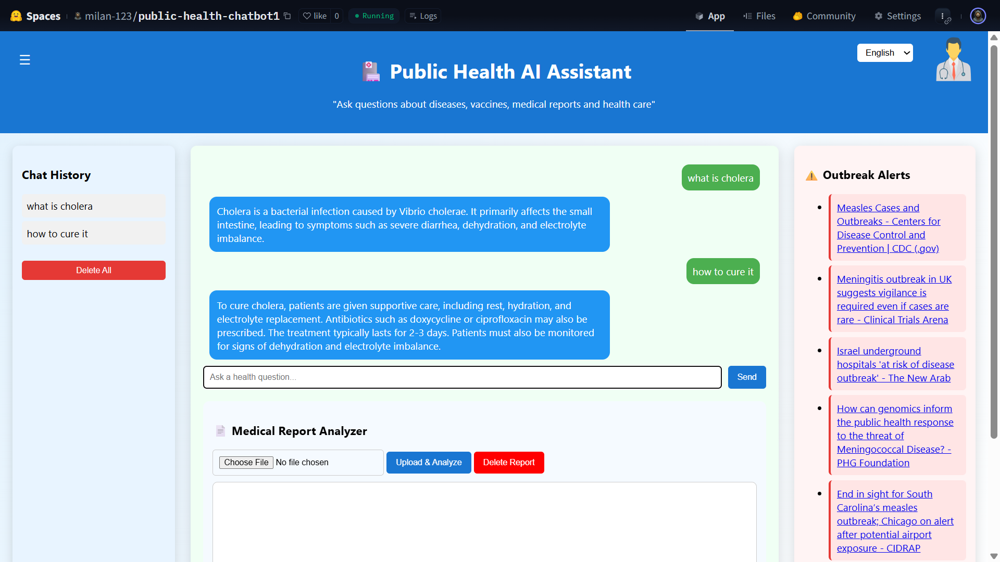
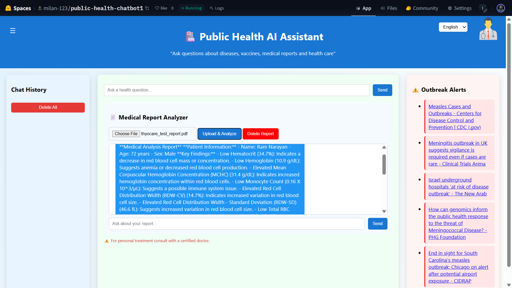
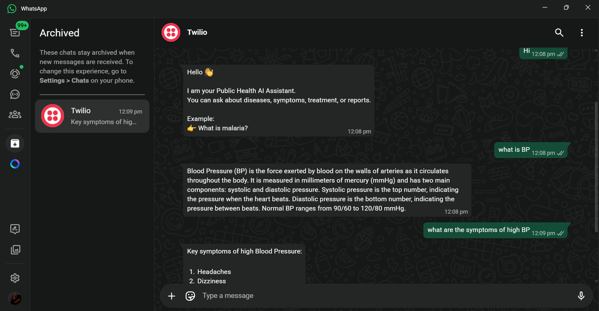

# 🩺 AI-Driven Public Health Chatbot for Disease Awareness

<p align="center">


</p>

---

## 📌 Project Overview

**AI-Driven Public Health Chatbot for Disease Awareness** is an intelligent healthcare assistant that provides reliable disease-related information using **Retrieval-Augmented Generation (RAG)** and **Large Language Models (LLMs)**.

The chatbot retrieves relevant medical knowledge from trusted healthcare documents before generating responses, resulting in more accurate and context-aware answers.

Apart from answering health-related questions, the system also supports:

- 🩺 Disease Awareness
- 📄 Medical Report Analysis
- 🌍 Multilingual Communication
- 💬 WhatsApp Bot Integration
- 🧠 Context-Aware Conversations

---

# ✨ Key Features

### 🤖 AI-Powered Healthcare Chatbot

- Retrieval-Augmented Generation (RAG)
- Context-aware responses
- Multi-turn conversation
- Medical knowledge retrieval

---

### 📄 Medical Report Analyzer

- Upload PDF medical reports
- Automatic report analysis
- Key findings extraction
- Health recommendations
- Easy-to-understand explanations

---

### 🌍 Multilingual Support

Supports:

- English
- Hindi
- Odia

using **NLLB-200-distilled-600M** translation model.

---

### 💬 WhatsApp Integration

Users can communicate with the chatbot directly through WhatsApp using **Twilio API**, making healthcare assistance available on mobile devices.

---

### ⚡ Fast Response Generation

Powered by

- Groq API
- Llama 3-8B
- Precomputed Embeddings

for low-latency inference.

---

# 🏗️ System Architecture

```
User
   │
   ▼
Frontend (HTML/CSS/JavaScript)
   │
   ▼
FastAPI Backend
   │
   ├──────── Translation Module
   │
   ├──────── Memory Module
   │
   ├──────── RAG Pipeline
   │
   ├──────── Medical Report Analyzer
   │
   └──────── WhatsApp Bot
                │
                ▼
          Groq Llama-3-8B
                │
                ▼
         AI Generated Response
```

---

# 🧠 RAG Workflow

```
User Query
      │
      ▼
Embedding Generation
      │
      ▼
Similarity Search
      │
      ▼
Retrieve Relevant Context
      │
      ▼
Prompt Construction
      │
      ▼
Groq Llama-3-8B
      │
      ▼
Final Response
```

---

# 🛠️ Tech Stack

| Category | Technologies |
|-----------|--------------|
| Backend | FastAPI |
| Frontend | HTML, CSS, JavaScript |
| Language | Python |
| LLM | Llama 3-8B (Groq) |
| Translation | NLLB-200-distilled-600M |
| Embeddings | Sentence Transformers |
| Retrieval | NumPy Embeddings |
| Dataset | WHO & MoHFW Healthcare Documents |
| PDF Processing | PyPDF |
| Messaging | Twilio WhatsApp API |
| Deployment | Hugging Face Spaces |

---

# 📂 Project Structure

```
AI-Driven-Public-Health-Chatbot/

│
├── backend/
│   ├── main.py
│   ├── rag.py
│   ├── memory.py
│   ├── translation.py
│   ├── outbreak.py
│   └── data/
│
├── frontend/
│   ├── index.html
│   ├── style.css
│   └── script.js
│
├── create_embeddings.py
├── embeddings.npy
├── run.py
├── requirements.txt
├── Dockerfile
└── README.md
```

---

# 📷 Screenshots

## 🖥️ Web Chatbot Interface



---

## 📄 Medical Report Analyzer



---

## 💬 Twilio WhatsApp Bot



---

# 🚀 Installation

Clone repository

```bash
git clone https://github.com/yourusername/AI-Driven-Public-Health-Chatbot.git

cd AI-Driven-Public-Health-Chatbot
```

Install dependencies

```bash
pip install -r requirements.txt
```

Create embeddings

```bash
python create_embeddings.py
```

Run project

```bash
python run.py
```

Open

```
http://127.0.0.1:8000
```

---

# 📊 Dataset

The chatbot uses curated healthcare documents collected from trusted public health organizations including:

- World Health Organization (WHO)
- Ministry of Health & Family Welfare (MoHFW)
- Disease Awareness PDFs
- Public Health Guidelines

These documents are converted into JSON format and embedded for semantic retrieval.

---

# 🎯 Future Improvements

- Voice-based interaction
- Mobile application
- Electronic Health Record (EHR) integration
- Real-time disease surveillance
- Personalized healthcare recommendations
- Advanced diagnostic support

---

# 👨‍💻 Author

**Milan Kumar**

B.Tech Computer Science & Engineering (AI & ML)

- GitHub: https://github.com/milan-7417
- LinkedIn: https://linkedin.com/in/milan-kumar-14167a30b

---

# ⭐ If you found this project useful, don't forget to star the repository.
